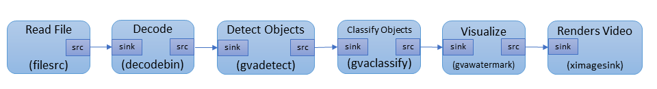

# GStreamer Video Analytics Tutorial

This tutorial uses four exercises to help you:

- Build a video analytics pipeline with the GStreamer* gst-launch tool and GStreamer Video Analytics (GVA) plug-in. 
- Add classifications to the pipeline.
- Publish the inference results to a `.json` file.
- Convert a deep learning model to the Intermediate Representation format that is required for the Inference Engine.

The first three exercises build on each other in increasing complexity. If you are new to using the DL Streamer, complete these in order. 

Before beginning the exercises, you must download the models and videos that the tutorials use. You should also read the information about the elements used in a GVA pipeline to help you understand the elements and options the exercises use.

### Prepare the System (Download Media, Install Requirements)

<details>
	<summary>Prepare the System</summary>
<br>

NOTE: The recommended way to install DL Streamer is through OpenVINO.  DL Streamer is included with OpenVINO 2020.r2 and newer.  If you have not installed OpenVINO, refer to the [DL Streamer Install Guide](Install_Guide.md).


### Install Requirements
```sh
sudo apt update && sudo apt install -y --no-install-recommends \
	wget cpio cmake lsb-release mesa-utils gdb mc ocl-icd-libopencl1 clinfo vainfo
```

### Get the Models and Videos for the Examples<a name="acquire-data-and-sources"></a>

The DL Streamer plug-in uses the OpenVINO Deep Learning [Inference Engine](https://software.intel.com/en-us/articles/OpenVINO-InferEngine) to perform inference. As input, the Inference Engine accepts CNN models that are converted to the Intermediate Representation (IR) format through the OpenVINO toolkit [Model Optimizer](https://docs.openvinotoolkit.org/latest/_docs_MO_DG_Deep_Learning_Model_Optimizer_DevGuide.html). 

You can either train your own CNN models and convert them to the IR format or use free models from the [OpenVINO Model Zoo](https://github.com/opencv/open_model_zoo) that are already in the IR format. A tool named [Model Downloader](https://docs.openvinotoolkit.org/2020.1/_tools_downloader_README.html) gives you a way to easily download models from the Model Zoo. 

The steps below use a quick way to get everything you need to use the sample applications. For instructions to use your own models, download models from the Model Zoo and use the Model Downloader, see LINK TO OPENVINO CONTENT. 

Remember to source your environment:
   ```sh
   source /opt/intel/openvino/bin/setupvars.sh
   ```

1. Create directories for the models and videos. The following is an example. If you use a different structure, remember to change the path in the instructions to match your location:
   ```sh
   mkdir -p ~/gva/models
   mkdir -p ~/gva/video
   ```

2.	Set the path to store the models we download.
    ```sh	
    export MODELS_PATH=~/gva/models
    ```
   
3. Download the models:
	```sh
	cd ~/gva/models
	```
	```sh
	/opt/intel/openvino/data_processing/dl_streamer/samples/download_models.sh
	```

4. The samples require video files that:

- Are in h264 or mp4 format.
- Include cars, pedestrians, and people with their faces showing.
- Keep your videos to less than 2 minutes for faster processing.
	
5. Download videos

- You can download freely licensed videos from the websites like [Pexels](https://www.pexels.com/videos).
- Put your video files in `~/gva/video`.

</details>

### Learn about the Video Analytics Pipeline and the GVA Elements <a name="gva-pipeline"></a> 

<details>
	<summary>Learn about the Video Analytics Pipeline and the GVA Elements</summary>

<br>
The diagram below shows the data flow of a typical video analytics pipeline.



This is what you're seeing in the data flow:

1. Read File with `filesrc` - The `filesrc` element reads data from a file or camera.

2. Decode with `decodebin` -  The `decodebin` element selects the decoder according to the input format. Hardware decoding plug-ins have priority over CPU decoders. Use `decodebin` to insert video processing elements for color conversion or for video-to-system memory copying. <br>
The pipeline moves the uncompressed video from `decodebin` forward in 'video/x-raw' or 'video/x-raw(memory:VASurface)' data type. 'video/x-raw' is a system memory frame and 'video/x-raw(memory:VASurface)' is a video memory handle.

3. Detect Objects with `gvadetect` - The `gvadetect` element runs object detection inference on the decoded frame from `decodebin`. In this process, `gvadetect` uses the `model` parameter to perform inference on the model that you specify. As an option, you can add the `model-proc` parameter to configure the output. A list of regions is returned, known as Region of Interest (ROI), The ROI includes the detected object. 
4. Classify Objects with `gvaclassify` - The `gvaclassify` element performs inference on each video frame ROI. Inference uses the `model` parameter, and returns the result as key=value, such as age=40 or gender=female. Use the `model-proc` parameter with `gvaclassify` to provide a json file for interpreting the results and to configure the output layer name and labels. You can also use 'gvaclassify' to add filters to the inference, but only on by object class, such as a vehicle or pedestrian. 

5. Visualize with `gvawatermark` - The `gvawatermark` element adds the detection and classification results as an overlay on each frame. This element uses a `sync` property. Most samples set this as `sync=false` to disable real-time synchronization to increase the pipeline speed. You can change this to `sync=true` to run pipeline in  real-time speed.

6. Render Video with `xvimagesink` - The `xvimagesink` element renders the video frames. 

You can chain the `gvadetect`, `gvatrack`, `gvaclassify`, and `gvainference` inference elements. For example, you can have the following run in sequence: object detection, object tracking, and object classification. You can also add other GVA elements to use `gvametaconvert` and `gvametapublish` to publish the inference results. 

See [GVA elements](Elements) for more information about the GVA plug-in elements.

The following video shows the result of running a pipeline with:

- gst-launch-1.0 filesrc location=cut.mp4 ! decodebin ! gvadetect model=face-detection-adas-0001.xml ! gvaclassify model=emotions-recognition-retail-0003.xml model-proc=emotions-recognition-retail-0003.json ! gvawatermark ! xvimagesink sync=false

<div align="center"></div>

The elements in this pipeline are:
* `filesrc` loads a video file named `cut.mp4`.
* `decodebin` decodes the video. 
* `gvadetect` runs inference on the video. The `model` named `face-detection-adas-0001` is used for inference to detect faces. 
* `gvaclassify` uses the result of `gvadetect` on a `model` named `emotions-recognition-retail-0003`, resulting in emotion classifications. 
* `gvawatermark` overlays the detection and classification results on each frame.
* `xvimagesink` renders the video frames.

You are ready to try creating your own pipeline. Continue with the next section to use the first exercise.

</details>


### Exercise 1: Build a Simple Pipeline <a name="simple-pipeline"></a>

<details>
	<summary>Build a Simple Pipeline</summary>
<br>

This exercise helps you create a GStreamer pipeline that uses specific models to run detection on an Intermediate Representation (IR) formatted model. In this exercise you run inference to detect people and vehicles in a video.  

This exercise introduces you to using the following GVA elements:

- `filesrc`
- `gvadetect` 
- `gvawatermark`
	
1. Set the environment variables:

```sh
source /opt/intel/openvino/bin/setupvars.sh
```

2. Export the `model` and `model_proc` files:

```sh
export DETECTION_MODEL=~/gva/models/intel/person-vehicle-bike-detection-crossroad-0078/FP32/person-vehicle-bike-detection-crossroad-0078.xml
```
```sh
export DETECTION_MODEL_PROC=/opt/intel/openvino/data_processing/dl_streamer/samples/gst_launch/vehicle_pedestrian_tracking/model_proc/person-vehicle-bike-detection-crossroad-0078.json
```

3. Export the video file path:

This example uses ~/gva/video as the video path and <your_video> as the placeholder for a video file name. Change this information to fit your setup.

```sh
export VIDEO_EXAMPLE=~/gva/video/<your_video>
```

4. Create and run the pipeline. As an option, add the `model-proc` parameter to create a `model-proc` JSON file. `model-proc` files describe the model input and output layer format. The `model-proc` file in this exercise describes the output layer name and labels (person, vehicle, and bike) on objects it detects. 

See [model-proc](https://github.com/opencv/gst-video-analytics/blob/master/samples/model_proc/person-vehicle-bike-detection-crossroad-0078.json) for more information.

```sh
gst-launch-1.0 \
	filesrc location=${VIDEO_EXAMPLE} ! decodebin ! video/x-raw ! videoconvert ! \
	gvadetect model=${DETECTION_MODEL} model_proc=${DETECTION_MODEL_PROC} device=CPU ! queue ! \
	gvawatermark ! fpsdisplaysink video-sink=xvimagesink sync=false
```
	
5. Review the output. Persons, vehicles, and bikes are bound by colored boxes, and detection results are displayed as video overlays. The average frame rate of the pipeline are shown as overlays at the bottom of the video.

`gvadetect`:
	* Used the XML model file to find the BIN file for inference.
	* Performed detection on each video frame.
	* Output ROIs with labels according to `model-proc` specifications. 

`gvawatermark` used the output ROIs to visually display the detected objects and their attributes.
	* [`fpsdisplaysink`](https://gstreamer.freedesktop.org/documentation/debugutilsbad/fpsdisplaysink.html?gi-language=c) displayed the average FPS of the pipeline.
	* [`xvimagesink`](https://gstreamer.freedesktop.org/documentation/xvimagesink/index.html?gi-language=c#xvimagesink-page) rendered the video frames.

You're done building and running this pipeline. To expand on this exercise, use one or both add-ons to this exercise to select different video sources. If the add-ons don't suit you, jump ahead to start [Exercise 2](#classification-pipeline)

</details>


#### Simple Pipeline with a Web Camera Video Stream (Optional - Requires WebCam)

<details>
	<summary>Simple Pipeline with a Web Camera Video Stream</summary>
<br>

GStreamer supports connected video devices, like Web cameras, which means you use a web camera to perform real-time inference.

Before repeating Exercise 1 with a Web camera video stream, verify the Web camera path. The Web camera stream is usually in the `/dev/` directory. 

To use a Web camera:

```sh
    gst-launch-1.0 \
	v4l2src device=<path-to-device> ! decodebin ! video/x-raw ! videoconvert ! \
	gvadetect model=${DETECTION_MODEL} model_proc=${DETECTION_MODEL_PROC} device=CPU ! queue ! \
	gvawatermark ! fpsdisplaysink video-sink=xvimagesink sync=false
```

This command uses [`v4l2src`](https://gstreamer.freedesktop.org/documentation/video4linux2/v4l2src.html?gi-language=c) instead of `filesrc` to capture video from web camera.

#### Simple Pipeline with an RTSP Device (Optional - Requires RTSP Device)

GStreamer supports RTSP devices that specify an RTSP URI, which means you can point to this URL to perform real-time inference.

Before repeating Exercise 1 with an RTSP URI, verify the RTSP URL. 

**To repeat Exercise 1 with a RTSP URI**, verify the path to the RTSP URI, and run the pipeline with the RTSP URI: 

```sh
gst-launch-1.0 \
	urisourcebin uri=<RTSP_uri> ! decodebin ! video/x-raw ! videoconvert ! \
	gvadetect model=${DETECTION_MODEL} model_proc=${DETECTION_MODEL_PROC} device=CPU ! queue ! \
	gvawatermark ! fpsdisplaysink video-sink=xvimagesink sync=false
```

This command uses [`urisourcebin`](https://gstreamer.freedesktop.org/documentation/playback/urisourcebin.html?gi-language=c) to access URIs. In this pipeline, the URI access is to the RTSP URI and the video stream from the link for inference.

</details>


### Exercise 2: Build a Classification Pipeline <a name="classification-pipeline"></a>

<details>
	<summary>Build a Classification Pipeline</summary>
<br>	

This exercise uses the scenario, video, and IR files from Exercise 1 to help you create a pipeline with classification applied to the ROIs. In Exercise 2, detected objects use `gvadetect` as inputs for `gvaclassify` for inference to identify additional attributes.

This exercises uses the following additional GVA element:
- `gvaclassify`
	
1. If not already setup, set the environment variables:

```sh
source /opt/intel/openvino/bin/setupvars.sh
```

2. Export the model and model_proc files:

```sh
export DETECTION_MODEL=~/gva/models/intel/person-vehicle-bike-detection-crossroad-0078/FP32/person-vehicle-bike-detection-crossroad-0078.xml
export DETECTION_MODEL_PROC=/opt/intel/openvino/data_processing/dl_streamer/samples/gst_launch/vehicle_pedestrian_tracking/model_proc/person-vehicle-bike-detection-crossroad-0078.json
export VEHICLE_CLASSIFICATION_MODEL=~/gva/models/intel/vehicle-attributes-recognition-barrier-0039/FP32/vehicle-attributes-recognition-barrier-0039.xml
export VEHICLE_CLASSIFICATION_MODEL_PROC=/opt/intel/openvino/data_processing/dl_streamer/samples/gst_launch/vehicle_pedestrian_tracking/model_proc/vehicle-attributes-recognition-barrier-0039.json
```

3. Export the video file path:

Make sure to replace <your_downloaded_video> with the name of the video you want to use.

This example uses ~/gva/video as the video path and <your_downloaded_video> as the placeholder for a video file name. Change this information to fit your setup.
```sh
export VIDEO_EXAMPLE=~/gva/video/<your_downloaded_video>
```

4. Create and run the pipeline:

```sh
gst-launch-1.0 \
	filesrc location=${VIDEO_EXAMPLE} ! decodebin ! video/x-raw ! videoconvert ! \
	gvadetect model=${DETECTION_MODEL} model_proc=${DETECTION_MODEL_PROC} device=CPU ! queue ! \
	gvaclassify model=${VEHICLE_CLASSIFICATION_MODEL} model-proc=${VEHICLE_CLASSIFICATION_MODEL_PROC} device=CPU object-class=vehicle ! queue ! \
	gvawatermark ! fpsdisplaysink video-sink=xvimagesink sync=false
```

In this pipeline:

1. `gvadetect` detects the ROIs in the video and outputs ROIs with the appropriate attributes (person, vehicle, bike) according to its model-proc. 
2. `gvadetect` ROIs are used as inputs for the `gvaclassify` model.
3. `gvaclassify` classifies the ROIs and outputs additional attributes according to model-proc:
	* `object-class` tells `gvalcassify` which ROIs to classify. 
	* `object-class=vehicle` classifies ROIs that have the 'vehicle' attribute. 
4 `gvawatermark` displays the ROIs and their attributes. 

See [model-proc](https://github.com/opencv/gst-video-analytics/tree/master/samples/model_proc) for the model-procs and its input and output specifications.

**Optional replacement command to create and run the pipeline**: Include `gvatrack` to increase the pipeline performance. With this, object tracking performance increases by running inference on object detection and classification models at a defined frequently.

To use this optional replacement command, create and run the pipeline as follows:

```sh
gst-launch-1.0 \
    filesrc location=${VIDEO_EXAMPLE} ! decodebin ! videoconvert ! video/x-raw,format=BGRx ! \
    gvadetect model=${DETECTION_MODEL} model_proc=${DETECTION_MODEL_PROC} device=CPU inference-interval=10 ! queue ! \
    gvatrack tracking-type=short-term ! queue ! \
    gvaclassify model=${VEHICLE_CLASSIFICATION_MODEL} model-proc=${VEHICLE_CLASSIFICATION_MODEL_PROC} device=CPU object-class=vehicle reclassify-interval=10 ! queue ! \
    gvawatermark ! videoconvert ! fpsdisplaysink video-sink=xvimagesink sync=false

```

In this pipeline:

1. `gvadetect` detects the ROIs in the video and outputs ROIs with the appropriate attributes (person, vehicle, bike) according to its model-proc **on every 10th frame, due to `inference-interval=10`**.
	*`gvatrack` tracks each object detected by `gvadetect`
	
2. `gvadetect` ROIs are used as inputs for the `gvaclassify` model.

3. `gvaclassify` classifies the ROIs and outputs additional attributes according to model-proc, **but skips classification for already classified objects for 10 frames, using tracking information from `gvatrack` to determine whether to classify an object**:
	* `object-class` tells `gvalcassify` which ROIs to classify. 
	* `object-class=vehicle` classifies ROIs that have the 'vehicle' attribute. 
	
4. `gvawatermark` displays the ROIs and their attributes. 

You're done building and running this pipeline. The next exercise shows you how to publish your results to a .`.json`.
	
</details>

### Exercise 3: Publish Inference Results
<details>
	<summary>Publish Inference Results</summary>
<br>

This exercise extends the pipeline to publish your detection and classification results to a `.json` file from a GStreamer pipeline.

This exercises uses the following additional GVA elements:

- `gvametaconvert`
- `gvametapublish` 

The script for this exercise is in the [`metapublish`](https://github.com/opencv/gst-video-analytics/blob/master/samples/gst_launch/metapublish/) directory where the GVA plug-ins sample scripts are located. The `metapublish` directory also contains scripts to publish results to Kafka and MQTT.

1. Set the OpenVINO environment:

> NOTE: For this exercise, you must reset the env variables as described below.

```sh
source /opt/intel/openvino/data_processing/gstreamer/bin/gstreamer-setupvars.sh
source /opt/intel/openvino/bin/setupvars.sh
```

2. Export the `model` and `model_proc` files:
```sh
export DETECTION_MODEL=~/gva/models/intel/person-vehicle-bike-detection-crossroad-0078/FP32/person-vehicle-bike-detection-crossroad-0078.xml
export DETECTION_MODEL_PROC=/opt/intel/openvino/data_processing/dl_streamer/samples/gst_launch/vehicle_pedestrian_tracking/model_proc/person-vehicle-bike-detection-crossroad-0078.json
export VEHICLE_CLASSIFICATION_MODEL=~/gva/models/intel/vehicle-attributes-recognition-barrier-0039/FP32/vehicle-attributes-recognition-barrier-0039.xml
export VEHICLE_CLASSIFICATION_MODEL_PROC=/opt/intel/openvino/data_processing/dl_streamer/samples/gst_launch/vehicle_pedestrian_tracking/model_proc/vehicle-attributes-recognition-barrier-0039.json
```

3. Export the video file path:

```sh
# # This example uses ~/gva/video as the video path and FILENAME as the placeholder for a video file name. Change this information to fit your setup.
export VIDEO_EXAMPLE=~/gva/video/<your_downloaded_video>
```

4. Export the output file path:

The $OUTFILE target can be any path and name.  We suggest: `~/gva/out.json`

```sh
# This example uses ~/gva/video as the video path and FILENAME as the placeholder for an output file name. Change this information to fit your setup. 
export OUTFILE=<path-to-FILENAME>
```

5. Create and run the pipeline:

```sh
gst-launch-1.0 \
	filesrc location=${VIDEO_EXAMPLE} ! decodebin ! video/x-raw ! videoconvert ! \
	gvadetect model=${DETECTION_MODEL} model_proc=${DETECTION_MODEL_PROC} device=CPU ! queue ! \
	gvaclassify model=${VEHICLE_CLASSIFICATION_MODEL} model-proc=${VEHICLE_CLASSIFICATION_MODEL_PROC} device=CPU object-class=vehicle ! queue ! \
	gvametaconvert format=json ! \
	gvametapublish method=file file-path=${OUTFILE} ! \
	fakesink
```

In this step:
- `gvametaconvert` uses the optional parameter `format=json` to convert inferenced data to `GstGVAJSONMeta`. 
- `GstGVAJSONMeta` is a custom data structure that represents JSON metadata. 
- `gvametapublish` uses the optional parameter `method=file` to publish inference results to a file.
- `filepath=${OUTFILE}` is a JSON file to which the inference results are published.
	
5. Run the pipeline. After the pipeline completes, a JSON file of the inference results is available. 

6. Review the JSON file (defined by $OUTFILE).

```sh
gedit $OUTFILE
```

You have completed this exercise. Continue to Exercise 4, where you will learn to convert Cafe and Tensorflow CNN models.

</details>

### Exercise 4: Create a Face Detection Pipeline <a name="face-detect"></a>

<details>
	<summary>Create a Face Detection Pipeline</summary>
<br>

This exercise asks you to combine the knowledge you've learned in the previous tutorials to create your own pipeline using a face detection model.  Feel free to review previous material, such as the [OpenVINO Samples Guide](../README.md) or the [OpenVINO Overview](../OpenVINO_Overview.md)

1. Download a video with faces from Pexels.
2. Select a suitable face detection model (download if necessary).
2. Update environment variables to point to the new video, model, and associated json file.
3. Run the new pipeline using the `gst-launch-1.0` command.
4. Add another element (either age-gender or emotion) for classification to the above pipeline and run it.

</details>

### Exercise 5: Create a Vehicle Detection Pipeline <a name="vehicle-detect"></a>

<details>
	<summary>Create a Vehicle Detection Pipeline</summary>
<br>
	
1. Download video and vehicle detection models.
2. Run a pipeline.
3. Optional: run a pipeline with an additional vehicle attributes model.

</details>

### Exercise 6: Use DL Streamer to Offload the Processing to a Target Device

<details>
	<summary>Run DL Streamer on the VPU</summary>
	
Please refer to the [DL_Streamer_VPU_Sample](DL_Streamer_VPU.md) guide.

</details>
