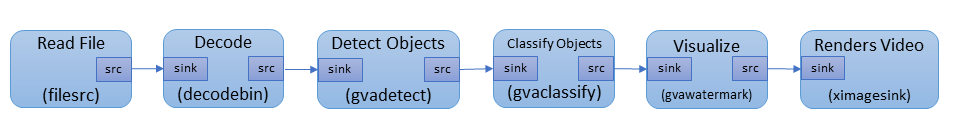

# Install DL Streamer

This guide provides instructions to prepare a computer running Ubuntu Linux 18.04.x (LTS) 64-bit 
to use DL Streamer, a GStreamer Video Analytics (GVA) plug-in and a part of the Intel® Distribution of OpenVINO<sup>&#8482;</sup> toolkit.

The DL Streamer plug-in contains multiple GStreamer elements to construct pipelines. Some elements run inference operations such as detection, classification, and tracking, and other elements output inference results to the display screen, file, or publish the results to the Kafka or MQTT message brokers.

The following diagram shows the interactions between the Intel OpenVINO toolkit and the DL Streamer:
<br>

<br>


This guide and the related tutorials and development information address the information on the Runtime part of the diagram. This is on the right side of the dashed line.

If you need help during or after the installation, [click here](https://github.com/opencv/gst-video-analytics/issues). 

## Prepare the Host System


1. Install the following Ubuntu packages if they aren't already installed:

	```sh
	sudo apt update && sudo apt install -y --no-install-recommends \
		wget cpio cmake lsb-release mesa-utils gdb mc ocl-icd-libopencl1 clinfo vainfo
	```
	
2. Clone the analytics repository:
	```sh
	mkdir -p ~/gva
	# Download GVA repository
	git clone https://github.com/opencv/gst-video-analytics ~/gva/gst-video-analytics
	cd ~/gva/gst-video-analytics
	```
	
3. (Optional): Build Paho MQTT version 1.3.0 if you want to use the Paho MQTT message broker:
	```sh
	export PAHO_VER=1.3.0
	export PAHO_REPO=https://github.com/eclipse/paho.mqtt.c/archive/v${PAHO_VER}.tar.gz
	wget -O - ${PAHO_REPO} | tar -xz; \
		cd paho.mqtt.c-${PAHO_VER};  \
		make;  \
		make install;
	```
	
4. (Optional): Build RDKafka version 1.0.0-RC7 if you want to use the Kafka message broker:  
	```sh
	export RDKAFKA_VER=1.0.0-RC7
	export RDKAFKA_REPO=https://github.com/edenhill/librdkafka/archive/v${RDKAFKA_VER}.tar.gz
	wget -O - ${RDKAFKA_REPO} | tar -xz; \
		cd librdkafka-${RDKAFKA_VER}; \
		./configure; \
		make;  \
		make install;
	```

5. Click **one** of these options to install the DL Streamer:
	<details>
		<summary><b>Install a Docker container and install the DL Streamer in the container</b>: This is the recommended method. With these steps, the DL Streamer and its dependencies are installed in a Docker image on the host system without modifying the host system's environment. You will use the DL Streamer from a Docker container. </summary>

	1. Install [Docker CE.](https://docs.docker.com/install/)
	2. Use the method of your choice to build the Docker image: <a name="build-docker-image-from-sources"></a>
		* Use the open source version of the OpenVINO<sup>&#8482;</sup> toolkit:
		```sh
		cd ~/gva/gst-video-analytics/docker
		./build_docker_image.sh opensource
		```
		* Use the binary version of the source. Use this if you want to use an HDDL device:
		```sh
		cd ~/gva/gst-video-analytics/docker
		./build_docker_image.sh package
		```
		A Docker image named `gst-video-analytics:latest` is created. 
	
	3. Validate the Docker imaged:
		```sh
		docker images | grep gst-video-analytics | grep latest
		```
		This command returns the image `gst-video-analytics:latest` with the description. The Docker image is ready to run. 

		<b>Note</b> If the image isn't displayed, return to [Step 2](#build-docker-image-from-sources) and try again. Do not continue until you have successfully validated the Docker image.

	4. Click **one** of these methods to run the Docker image:

		<details>
			<summary><b>Use individual commands</b></summary>

		1. Connect the host's system X server from the Docker image:
			```sh
			xhost local:root
			```

		2. Run the container:
			```sh
			docker run -it --privileged --net=host \
			\
			-v ~/.Xauthority:/root/.Xauthority \
			-v /tmp/.X11-unix:/tmp/.X11-unix \
			-e DISPLAY=$DISPLAY \
			-e HTTP_PROXY=$HTTP_PROXY \
			-e HTTPS_PROXY=$HTTPS_PROXY \
			-e http_proxy=$http_proxy \
			-e https_proxy=$https_proxy \
			\
			-v ~/gva/data/models/intel:/root/intel_models:ro \
			-v ~/gva/data/models/common:/root/common_models:ro \
			-e MODELS_PATH=/root/intel_models:/root/common_models \
			\
			-v ~/gva/data/video:/root/video-examples:ro \
			-e VIDEO_EXAMPLES_DIR=/root/video-examples \
			\
			gst-video-analytics:latest
			```
			
			The options used in this command are:
				`--privileged` - required for the Docker container to access the host system's GPU.
				`--net=host` - provides the host network with access to the container. This is required to interact with X-server.
				`-v ~/.Xauthority` and `-v /tmp/.X11-unix` - files mapped to the container. These ensure authentication with X-server. `-v` maps host system directories in the Docker container.
				`-v -v /dev/video0:/dev/video0` - Uses video from a Web camera as the sample input. This parameter mounts the device.
				`-e` - instances set Docker container environment variables. Samples require some of these. 
				Proxy variables - required if the host system is behind a firewall.

		3. [OPTIONAL] Install message brokers if you want to publish inference results to Kafka or MQTT. You do not need to install the message brokers if you want to publish your inference results to the console or to a file. To install message brokers: 
			```sh
			cd ~/gva/gst-video-analytics/scripts/
			./install_metapublish_dependencies.sh
		
		Continue to [Get Models and Videos to use with the Samples](#acquire-data-and-sources). **Do not use the instructions to install the DL Streamer on the host system**. 
		
		</details>
		
		<details>
			<summary><b>Use a script</summary></b>

		1. OPTIONAL: Use the help message to review the script usage:
			```sh
			cd ~/gva/gst-video-analytics/docker  
			./run_docker_container.sh -h  # call help
			```
			Example output:
				```sh
				usage: sudo ./run_docker_container.sh [--video-examples-path=<path>]
				[--intel-models-path=<path>] [--models-path=<path>] [--image-name=<name>]
				```
		2. Run the Docker container script:
			```sh
			cd ~/gva/gst-video-analytics/docker  # essential
			export DATA_PATH=~/gva/data  # essential
			sudo ./run_docker_container.sh --video-examples-path=$DATA_PATH/video --intel-models-path=$DATA_PATH/models/intel --models-path=$DATA_PATH/models/common --image-name=gst-video-analytics:latest
			```
			
		3. [OPTIONAL] Install message brokers if you want to publish inference results to Kafka or MQTT. You do not need to install the message brokers if you want to publish your inference results to the console or to a file. To install message brokers: 
			```sh
			cd ~/gva/gst-video-analytics/scripts/
			./install_metapublish_dependencies.sh
		
		Continue to [Get Models and Videos to use with the Samples](#acquire-data-and-sources). **Do not use the instructions to install the DL Streamer on the host system**. 
		</details>
		
		Continue to [Get Models and Videos to use with the Samples](#acquire-data-and-sources). **Do not use the instructions to install the DL Streamer on the host system**. 
	</details>

	<details><summary><b>Install the DL Streamer on the host system</b>: In these steps, the DL Streamer and its dependencies are installed directly on the device. This is a multi-step installation process that installs several requirements. This installation is more time consuming than using a Docker container and environment issues have occurred when installing directly on the host system. <b>Do not use these steps if you already used the instructions to install the DL Streamer with a Docker image.</b></summary>

	1. [Download and carefully follow the instructions to install the Intel Distribution of OpenVINO Toolkit, R1](https://docs.openvinotoolkit.org/latest/_docs_install_guides_installing_openvino_linux.html)

	*NOTE*: During the installation, exclude these components on the *Configuration* screen

		* Models
		* OpenVX
		* MediaSDK

	2. Confirm the iHD driver installation and initialization. This is the VA-API:  
		```sh
		cd ~/gva/gst-video-analytics/scripts
		source ./setup_env.sh
		vainfo
		```
		Review the output for success.
	
	3. Build the GVA plugin:
		```sh
		source /opt/intel/openvino/bin/setupvars.sh
			
		# build GVA plugin
		mkdir ~/gva/gst-video-analytics/build
		cd ~/gva/gst-video-analytics/build
		cmake ..
		make -j8
		sudo make install
			
		# export environment variables
		export GST_PLUGIN_PATH=~/gva/gst-video-analytics/build/intel64/Release/lib:$GST_PLUGIN_PATH  # for GVA elements to be available system-wide
		```
		<b>Note:</b> the commands in "export environment variables" section are required each time to use GVA plugin. To set these environment variables automatically, you can add these commands to file `~/.bashrc`.
		
	4. [OPTIONAL] Install message brokers if yuo want to enable the `gvametapublish` element to publish inference results to Kafka or MQTT. You do not need to install the message brokers if you want to publish your inference results to the console or to a file: 
		```sh
		cd ~/gva/gst-video-analytics/scripts/
		./install_metapublish_dependencies.sh
		```
		
		You are done installing the DL Streamer. Continue to [Get Models and Videos to use with the Samples](Install_Guide.md#acquire-data-and-sources)
		
	</details>
