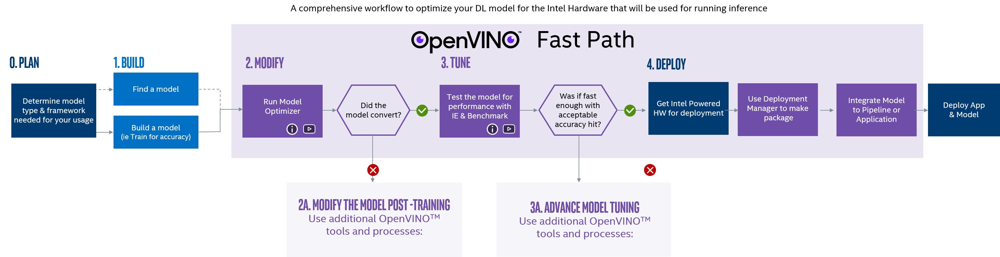

# OpenVINO™ Overview for Linux

The OpenVINO™ toolkit optimizes and runs Deep Learning Neural Network models on Intel® hardware. This guide helps you get started with the OpenVINO™ toolkit you installed on a Linux* operating system. 

In this guide, you will:
* Learn the OpenVINO™ inference workflow.
* Get an explanation of the some of the most widely used tools.
    

## <a name="openvino-components"></a>OpenVINO™ toolkit Components
The toolkit consists of two primary components:
* **Inference Engine:** The software libraries that run inference against the Intermediate Representation (optimized model) to produce inference results.
* **Model Optimizer:** Optimizes models for Intel® architecture, converting models into a format compatible with the Inference Engine. This format is called an Intermediate Representation (IR).

## <a name=""></a>Other Important OpenVINO™ Assets
* **Intermediate Representation (IR):** The Model Optimizer output. A model converted to a format that has been optimized for Intel® architecture and is usable by the Inference Engine.  A single NN model will be converted to at least a bin and xml file.  Sometimes additional json configuration files are also produced, to provide hints to the Inference Engine.
* **IR bin files:**  These are the stored network weights.  This is the current state of the model after training.
* **IR xml files:**  This is the model architecture.  This is used to execute the model.
* **IR json files:** Sometimes a few json files are generated to help with unusual architectures.  They are hints for the Inference Engine.

In addition, code samples and applications are provided to help you get up and running with the toolkit:
* [**Code Samples**](https://docs.openvinotoolkit.org/latest/_docs_IE_DG_Samples_Overview.html) - Small console applications that show you how to: 
    * Utilize specific OpenVINO capabilities in an application
    * Help developers perform specific tasks, such as loading a model, running inference, querying specific device capabilities, and more.
* [**Demo Applications**](https://docs.openvinotoolkit.org/latest/_demos_README.html) - Console applications that provide robust application templates to help you implement specific deep learning scenarios. These applications involve increasingly complex processing pipelines that gather analysis data from several models that run inference simultaneously, such as detecting a person in a video stream along with detecting the person's physical attributes, such as age, gender, and emotional state.

## <a name="openvino-installation"></a>Intel® Distribution of OpenVINO™ Toolkit Directory Structure
By default, the installation directory is `/opt/intel/openvino`, but the installation gave you the option to use the directory of your choice. If you installed the Intel® Distribution of OpenVINO™ toolkit to a directory other than the default, replace `/opt/intel` with the directory in which you installed the software.

<details>
    <summary>Click for the Intel® Distribution of OpenVINO™ toolkit directory structure.</summary>
   

| Directory&nbsp;&nbsp;&nbsp;&nbsp;&nbsp;&nbsp;&nbsp;&nbsp; | Description                                                                           |  
|:----------------------------------------|:--------------------------------------------------------------------------------------|
| `demo/`                                 | Demo scripts. Demonstrate pipelines for inference scenarios, automatically perform steps and print detailed output to the console. For more information, see the [Use OpenVINO: Demo Scripts](#use-openvino-demo-scripts) section.|
| `inference_engine/`                     | Inference Engine directory. Contains Inference Engine API binaries and source files, samples and extensions source files, and resources like hardware drivers.|
| `~intel_models/` | Symbolic link to the `intel_models` subfolder of the `open_model-zoo` folder |
| &nbsp;&nbsp;&nbsp;&nbsp;&nbsp;&nbsp;`include/`      | Inference Engine header files. For API documentation, see the [Inference Engine API Reference](./annotated.html). |
| &nbsp;&nbsp;&nbsp;&nbsp;&nbsp;&nbsp;`lib/`          | Inference Engine binaries.|
| &nbsp;&nbsp;&nbsp;&nbsp;&nbsp;&nbsp;`samples/`      | Inference Engine samples. Contains source code for C++ and Python* samples and build scripts. See the [Inference Engine Samples Overview](./docs/IE_DG/Samples_Overview.md). |
| &nbsp;&nbsp;&nbsp;&nbsp;&nbsp;&nbsp;`src/`          | Source files for CPU extensions.|
| `model_optimizer/`                      | Model Optimizer directory. Contains configuration scripts, scripts to run the Model Optimizer and other files. See the [Model Optimizer Developer Guide](./docs/MO_DG/Deep_Learning_Model_Optimizer_DevGuide.md).
| `open_model_zoo/`                       | Open Model Zoo directory. Includes the Model Downloader tool to download [pre-trained OpenVINO](./docs/Pre_Trained_Models.md) and public models, OpenVINO models documentation, demo applications and the Accuracy Checker tool to evaluate model accuracy.|
| &nbsp;&nbsp;&nbsp;&nbsp;&nbsp;&nbsp;`demos/`        | Demo applications for inference scenarios. Also includes documentation and build scripts.| 
| &nbsp;&nbsp;&nbsp;&nbsp;&nbsp;&nbsp;`intel_models/` | Pre-trained OpenVINO models and associated documentation. See the [Overview of OpenVINO™ Toolkit Pre-Trained Models](./docs/Pre_Trained_Models.md).|
| &nbsp;&nbsp;&nbsp;&nbsp;&nbsp;&nbsp;`tools/`        | Model Downloader and Accuracy Checker tools. |
| `tools/`                                | Contains a symbolic link to the Model Downloader folder and auxiliary tools to work with your models: Calibration tool, Benchmark and Collect Statistics tools.|

</details>

## <a name="workflow-overview"></a>OpenVINO™ Workflow Overview

The simplified OpenVINO™ workflow is:
1. **Get a trained model** for your inference task. Example inference tasks: pedestrian detection, face detection, vehicle detection, license plate recognition, head pose.
2. **Run the trained model through the Model Optimizer** to convert the model to an Intermediate Representation, which consists of a pair of `.xml` and `.bin` files that are used Inference Engine input.
3. **Use the Inference Engine API in the application** to run inference against the Intermediate Representation (pptimized model) and output inference results. The application can be an OpenVINO™ sample, demo, or your own application. 
<br>



<br>

## Running Samples and Demos

All samples and demos require these fundamental steps.

1. Download a model or models.
2. Run the Model Optimizer to convert the model to the IR format.
3. Download videos, audio, or images for use in the sample (in some cases, a camera will work).
4. Run the sample, and provide it with paths to the model and media files.

Generally you need to keep track of the paths to all of these files.  You may want to move them into a convenient location or rename them.

### <a name="finding-models"></a> Step 1.1: Finding Models

You must have a model that is specific for you inference task. Example model types are:
- Classification (AlexNet, GoogleNet, SqueezeNet, others) - Detects one type of element in a frame.
- Object Detection (SSD, YOLO) - Draws bounding boxes around multiple types of objects.
- Custom (Often based on SSD)

Options to find a model suitable for the OpenVINO™ toolkit are:
- Download public and Intel's pre-trained models from the [Open Model Zoo](https://github.com/opencv/open_model_zoo) using [Model Downloader tool](https://docs.openvinotoolkit.org/latest/_tools_downloader_README.html#model_downloader_usage).
- Download from GitHub*, Caffe* Zoo, TensorFlow* Zoo, etc.
- Train your own model.

### <a name="model-downloader"></a>Step 1.2: Using the Model Downloader

The Model Downloader is a tool provided with OpenVINO™ to download pre-trained models from the Open Model Zoo.

* **List the models available in the downloader**: 
```sh
cd /opt/intel/openvino/deployment_tools/tools/model_downloader/
```
```sh
python3 info_dumper.py --print_all
```

* **Use `grep` to list models that have a specific name pattern**: 
```sh
python3 info_dumper.py --print_all | grep <model_name>
```

Use the Model Optimizer to download the models to a models directory of your choice. This guide uses `<models_dir>` as the models directory and `<models_name>` as the model name:
```sh
sudo python3 ./downloader.py --name <model_name> --output_dir <models_dir>
```
> **NOTE:** Always run the downloader with `sudo`.

### <a name="convert-models-to-intermediate-representation"></a> Step 2: Convert Models to the Intermediate Representation
If you have trained models that are not in Intel's IR format, they must be run through the Model Optimizer to convert them.  This is required before using the Inference Engine with the model.

Models in the Intermediate Representation format always include an `.xml` and `.bin` file, and may also include other files, like `.json`, `.mapping`, or others. Make sure you have these files in the same directory for the Inference Engine to find them.
- **REQUIRED:** `model_name.xml`
- **REQUIRED:** `model_name.bin`
- **OPTIONAL:** `model_name.json`, `model_name.mapping`, etc.

#### Model Precision
The Inference Engine can perform inference on different precision formats, such as `FP32`, `FP16`, `INT8`. 

To prepare an IR with specific precision, run the Model Optimizer with the appropriate `--data_type` option.

3. Run the Model Optimizer script:
   ```sh
   cd /opt/intel/openvino/deployment_tools/model_optimizer
   ```
   ```sh  
   python3 ./mo.py --input_model <model_dir>/<model_file> --data_type <model_precision> --output_dir <ir_dir>
   ```
   The produced IR files are in the `<ir_dir>` directory.


### <a name="download-media"></a> Step 3: Download a Video or a Still Photo as Media

Many sources are available from which you can download video media to use the code samples and demo applications. Possibilities include: 
- https://videos.pexels.com
- https://images.google.com

## Additional Resources
Use these resources to learn more about the OpenVINO™ toolkit:

<details>

* [OpenVINO™ Release Notes](https://software.intel.com/en-us/articles/OpenVINO-RelNotes)
* [Introduction to Intel® Deep Learning Deployment Toolkit](https://docs.openvinotoolkit.org/latest/_docs_IE_DG_Introduction.html)
* [Inference Engine Developer Guide](https://docs.openvinotoolkit.org/latest/_docs_IE_DG_Deep_Learning_Inference_Engine_DevGuide.html)
* [Model Optimizer Developer Guide](https://docs.openvinotoolkit.org/latest/_docs_MO_DG_Deep_Learning_Model_Optimizer_DevGuide.html)
* [Inference Engine Samples Overview](https://docs.openvinotoolkit.org/latest/_docs_IE_DG_Samples_Overview.html)
* [Overview of OpenVINO™ Toolkit Pre-Trained Models](https://software.intel.com/en-us/openvino-toolkit/documentation/pretrained-models)
* [OpenVINO™ Hello World Face Detection Exercise](https://github.com/intel-iot-devkit/inference-tutorials-generic)
</details>

